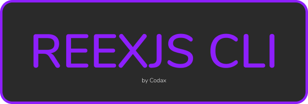
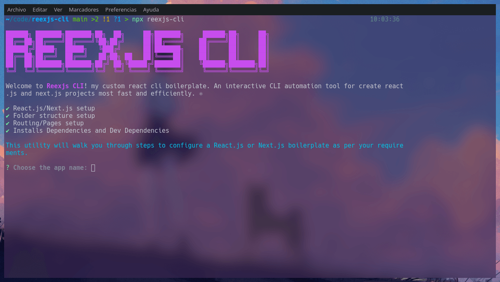

<h1>
    <a href="https://www.npmjs.com/package/reexjs-cli" target="_blank">
      
    </a>
</h1>

[](https://www.npmjs.com/package/reexjs-cli)
[](https://github.com/tterb/atomic-design-ui/blob/master/LICENSEs)

<h4 align="center">An interactive CLI automation tool 🛠️ for creating <a href="https://reactjs.org/" target="_blank">react.js</a> and <a href="https://nextjs.org/" target="_blank">next.js</a> projects most fast and efficiently. ⚛️</h4>


## About ℹ️

[ReexJs CLI](https://github.com/a12989x/reexjs-cli) is an interactive CLI that automates the process of creating a React / Next App.
Usually developers we spent a lot of time installing dependencies, creating folders, etc., before having our initial configuration and start working on the application.

The goal of [ReexJs CLI](https://github.com/a12989x/reexjs-cli) It is that we can start working on our application without worrying about the initial configuration.

## Features 🎉

-   Create a react.js or next.js app.
-   Choose from commonly used folders (assets, components, hooks, services, utils, e.t.c.) to create.
-   Or create folders with custom names.
-   Setup routing with user defined routes if you choose react.js.
-   Or create pages for nextjs.
-   And installs dependencies and dev dependencies.

## Requirements 📝

-   [Node.js](https://nodejs.org/en/) installed on your system.
-   An active internet connection for CLI to work.

## Installation 🚀

From your terminal run:

```shell
# install the package with NPM
$ npx reexjs-cli
# or install it with YARN
$ yarn reexjs-cli
```

## Documentation 📘

ReexJs CLI installs reexjs-cli command in your system. To run the tool, you need to invoke this command from your terminal:

```shell
# if you install it globally
$ reexjs-cli
```

As soon as run the command you are greeted by the CLI and you must choose between the options, the most approached your desired configuration.



Then you have to answer some questions to configure your react.js or next.js app


### Config ⚙️

Depending on the fact that Framework is chosen, different questions will be asked:

-   **App Name**:<br />
    Enter your app name. By default it fallbacks to `reexjs-app` <br /><br />
    ✅ Valid App Names:

    -   my-app
    -   onl1n3
    -   one-2-three

    ❌ Invalid App Names:

    -   My-App
    -   Onl1n3
    -   One-2-Three

-   **Framework**:<br />
    Choose the Framework of your application.

-   **Pages Names**: (_Next.Js_)<br />
    Enter space separated pages for next.js application.

-   **React Routing**: (_React.Js_)<br />
    Choose if react routes is needed. Yes or No.<br />
    If required, enter space separated routes names.

    ✅ Valid App Names::

    -   my-route
    -   one-two-three

    ❌ Invalid App Names:

    -   My-Route:
    -   one-2-three
    -   some-route/
    -   some.route
    -   some?route

-   **Create Folders**:<br />

    -   Predefined:

        -   You can choose from commonly use folders to create: `assets`, `components`, `utils`, `lib`.

    -   Custom:
        -   You can enter space separated folders. The conventions would be same as routes in react routing.

-   **Dependencies**: (`npm i <dependencies>`)<br />
    You can enter space separated dependencies. The conventions would be same as routes in react routing. E.g. `react-bootstrap lodash moment`.
    This script run the code

-   **Dev Dependencies**: (`npm i -D <devDependencies>`)<br />
    You can enter separated dev dependencies. The conventions would be same as routes in react routing. E.g. `prettier husky lint-staged`.

### TODOs ✅

-   Get notification every time an update is available 🔔.
-   Choose JavaScript and TypeScript 🔥.
-   Choose preferred export type: named or default 🤔.
-   Add supports popularly used CSS preprocessor SASS! 👓
-   Add Redux/MobX/useContext state management setup ⚙️.
-   Style your app EXACTLY Like Google 😎.

## License

ReexJs CLI is licensed under the terms of [MIT](https://choosealicense.com/licenses/mit/)

**Built with ❤️ by [Codax](https://github.com/a12989x).**
