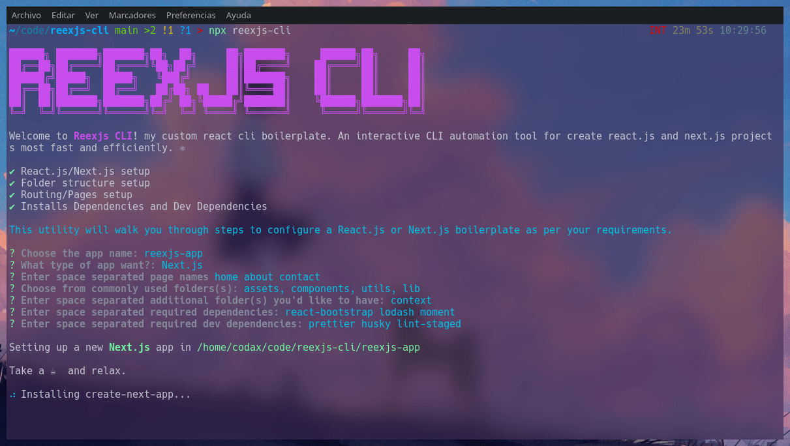

# Quick Start

From your terminal run:
You can install `reexjs-cli` globally or also you can use witn NPX and YARN.
<br />
Run the package with NPM:

```shell
$ npx reexjs-cli
```

Or use YARN:

```
$ yarn reexjs-cli
```

As soon as execute `reexjs-cli` you are greeted by the CLI and you must choose between the options, the most approached your desired configuration.
<br />
Then you have to answer some questions to configure your react.js or next.js app
<br />
And finally you will have your application fully configured With your preferences.


